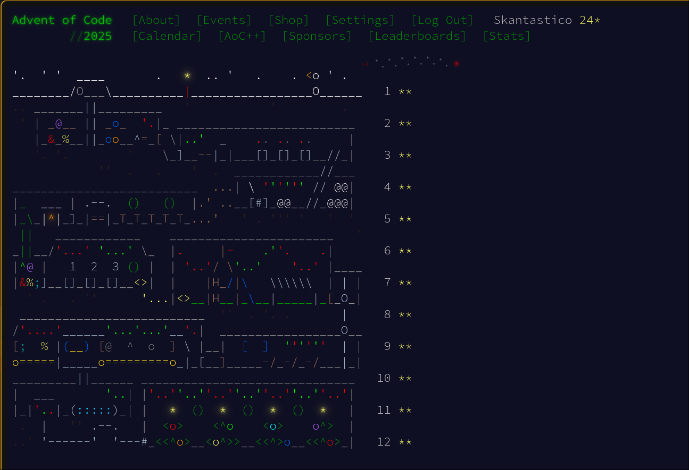
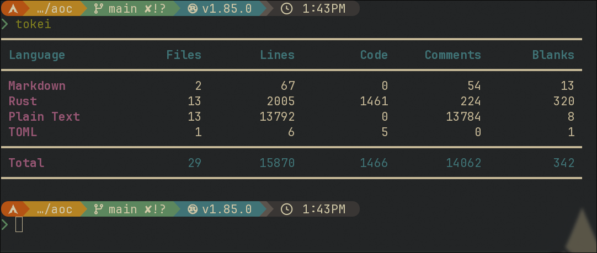

# My Advent of Code 2025 solutions

Written in Rust.

Each day has it own src/bin folder with the day as the directory name.
Inputs are designated as input.txt in each day folder.
Parts 1 and 2 are solved in main for each problem.

Fun one!

I used Claude Code as a read-only companion for help with concepts I'm rusty with (memoization, greedy algos, etc) and idiomatic syntax concepts I wanted to oxidize.

- [Day 1](src/bin/day_01/main.rs)
- [Day 2](src/bin/day_02/main.rs)
- [Day 3](src/bin/day_03/main.rs)
- [Day 4](src/bin/day_04/main.rs)
- [Day 5](src/bin/day_05/main.rs)
- [Day 6](src/bin/day_06/main.rs)
- [Day 7](src/bin/day_07/main.rs)
- [Day 8](src/bin/day_08/main.rs)
- [Day 9](src/bin/day_09/main.rs)
- [Day 10](src/bin/day_10/main.rs)
- [Day 11](src/bin/day_11/main.rs)
- [Day 12](src/bin/day_12/main.rs)

